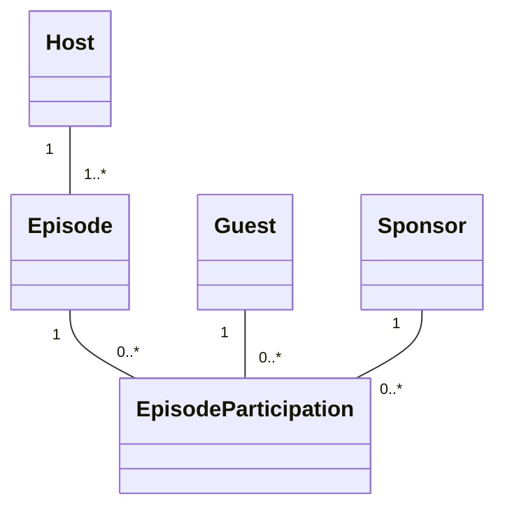

# Project .NET Framework

* Naam: Alexander Waumans
* Studentennummer: 123456789
* Academiejaar: 23-24
* Klasgroep: INF203A
* Onderwerp: Host, Guest, Episode

## Sprint 3

### Beide zoekcriteria ingevuld
```sql
SELECT "e"."Id", "e"."Category", "e"."Duration", "e"."EpisodeNumber", "e"."EpisodeTitle", "e"."HostId"
      FROM "Episodes" AS "e"
      LEFT JOIN "Hosts" AS "h" ON "e"."HostId" = "h"."Id"
      WHERE "h"."Rating" >= @__rating_0 AND "e"."Category" = @__category_1 

```

### Enkel zoeken op Host rating

```sql
SELECT "e"."Id", "e"."Category", "e"."Duration", "e"."EpisodeNumber", "e"."EpisodeTitle", "e"."HostId"
      FROM "Episodes" AS "e"
      LEFT JOIN "Hosts" AS "h" ON "e"."HostId" = "h"."Id"
      WHERE "h"."Rating" >= @__rating_0
```

### Enkel zoeken op Category
```sql
SELECT "e"."Id", "e"."Category", "e"."Duration", "e"."EpisodeNumber", "e"."EpisodeTitle", "e"."HostId"
      FROM "Episodes" AS "e"
      WHERE "e"."Category" = @__category_0
```

### Beide argumenten null

```sql
SELECT "e"."Id", "e"."Category", "e"."Duration", "e"."EpisodeNumber", "e"."EpisodeTitle", "e"."HostId"
      FROM "Episodes" AS "e"
```


## Sprint 4


## Sprint 6

### nieuwe host

### request

POST https://localhost:7087/api/Hosts/ HTTP/1.1
Content-Type: application/json

{"name": "test",
"yearFirstPublished" : 2015,
"rating" : 4.3,
"gender": 1
}

### response

HTTP/1.1 201 Created
Content-Type: application/json; charset=utf-8
Date: Sun, 17 Dec 2023 12:04:36 GMT
Server: Kestrel
Location: https://localhost:7087/api/Hosts
Transfer-Encoding: chunked

{
"id": 11,
"name": "test",
"yearFirstPublished": 2015,
"rating": 4.3,
"gender": 1,
"episodes": []
}

## Sprint 7

### Gebruikers

| Username       | Password    | Role  |
| -------------- | ----------- | ----- |
| user1@app.com | Password1! | Admin |
| user2@app.com | Password1! | User  |
| user3@app.com | Password1! | User  |
| user4@app.com | Password1! | User  |
| user5@app.com | Password1! | User  |

## API Requests

### unauthorized POST request
```POST https://localhost:7087/api/Hosts HTTP/1.1
Content-Type: application/json

{
"name": "HostTest",
"YearFirstPublished": "2012",
"Rating": "5",
"Gender": "Male"
}
```

### unauthorized POST response 
```
HTTP/1.1 401 Unauthorized
Content-Length: 0
Date: Sun, 03 Mar 2024 08:58:23 GMT
Server: Kestrel
Location: https://localhost:7087/Identity/Account/Login?ReturnUrl=%2Fapi%2FHosts
```

### authorized POST request

```
POST https://localhost:7087/api/Hosts HTTP/1.1
Content-Type: application/json
Cookie: .AspNetCore.Identity.Application=CfDJ8Fa7dzYtaSxMnz3kSL77wNnt4xjjIn5yhOE4UGjDl7F9YvjoG4r6VblggY4QxwySAqSk3knY7Fxra_x8jjVTlWUr2oaNaca7oAhW1JydL5ym9x1ECQ9CvFjbXpW8PyHVTsgpeWzYd4Ral1u9VUvBXugB_6gN5INzLhGa_BcXV5LuwHyZH178bKS5MLxUbPCkmgqJrEQqsFwnMkIGaJ5d_2eSyqOQE8Y8DDwwQXrqwieVg9Vtai9ZEWa0RF8d3ig7jGDoWJ-Hd7fF3JELECx9W2xj_3bmX_8MwBFvHk2d4zUWVB3fgZqxlezEuuwupPqSRPKg8ar26gyPFLaEVsOFxunZPUYG1FJid43cl5OyrsHn0_pR5fzmiK6aumvknuiaiVU_vY4NJa1C-nHW3C-JNw21XqD1GVFhplqHaGYgScNqC79GTGXGCFLcdfQ65n-LaFTG1tA2l20SdCbYAXos415392lSFuoqJ0hZYekezZ3Q2nlkJq_7s6padD8Jz1X6SoE8i9rR6NLZvv3GnS6tTKU4AiE5r4B-jTTVFP6NkDOWX1CIOIvvhY34RZibACU_4EKqPxt-ZZ6lUFEWn4FlUww8yD5o3iisQVuA2GZ7xqfX_AF3dCMbDUz8Ljorv1P-MYSX7B3xJLQ8HjGjUQL_w2At4Wm7CMMMuptSViY7Kd1bk-24CMS3moIoDy05WmbkUbMtDuCQziUUc-ffpSPcjwsWjK0E-drxkSnt9mmq3WPmMq8GMv7tRQg-S1eQAaKzMEFMoIhUA-d6xsRfdgpLU1Omm4oCWOdu45D67XEdI1QpFyyWZtqWpPOkSAZFfOSIAznerjrHmptGpdQpn1lWFo8

{
"name": "HostTest",
"YearFirstPublished": "2012",
"Rating": "5",
"Gender": "Male"
}
```


### authorized POST response
```
HTTP/1.1 201 Created
Content-Type: application/json; charset=utf-8
Date: Sun, 03 Mar 2024 09:04:12 GMT
Server: Kestrel
Location: https://localhost:7087/api/Hosts
Transfer-Encoding: chunked

{
"id": 11,
"name": "HostTest",
"yearFirstPublished": 2012,
"rating": 5,
"gender": "Male",
"episodes": []
}
```

# Sprint 8

```shell
dotnet test
```


fully qualified name van de klasse waar de complexe authorization requirements afgetoetst worden

Tests.UnitTests.EpisodesControllerTests

fully qualified name van de klasse waar je getest hebt met gebruik van
“verification”

Tests.UnitTests.GuestsControllerTests

https://gitlab.com/kdg-ti/programmeren-2---.net/23-24/isb204/projecten/alexander.waumans/-/pipelines/1224885336/test_report?job_name=tests

https://kdg-ti.gitlab.io/-/programmeren-2---.net/23-24/isb204/projecten/alexander.waumans/-/jobs/6462025551/artifacts/coveragereport/index.html
